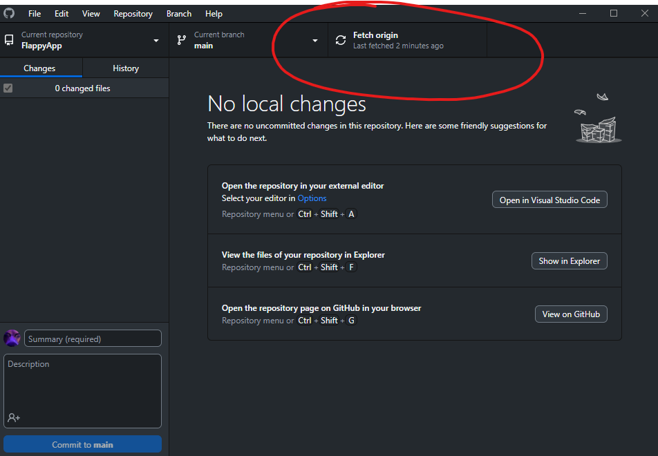
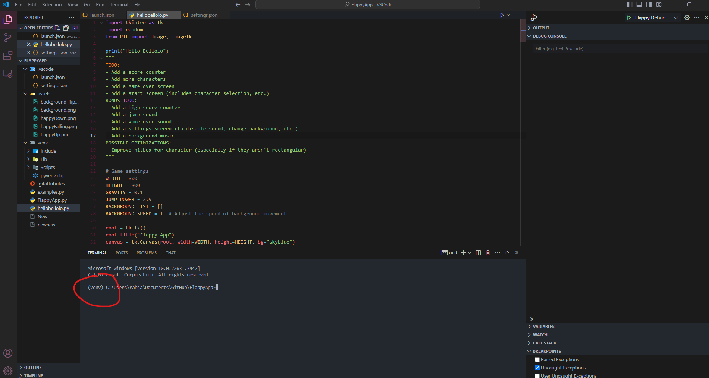
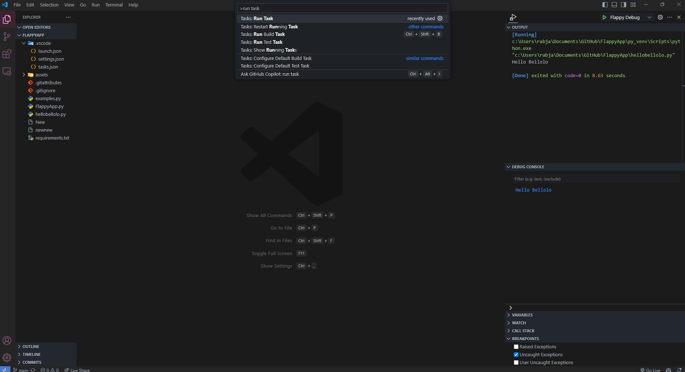
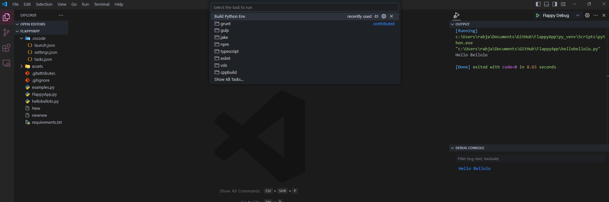
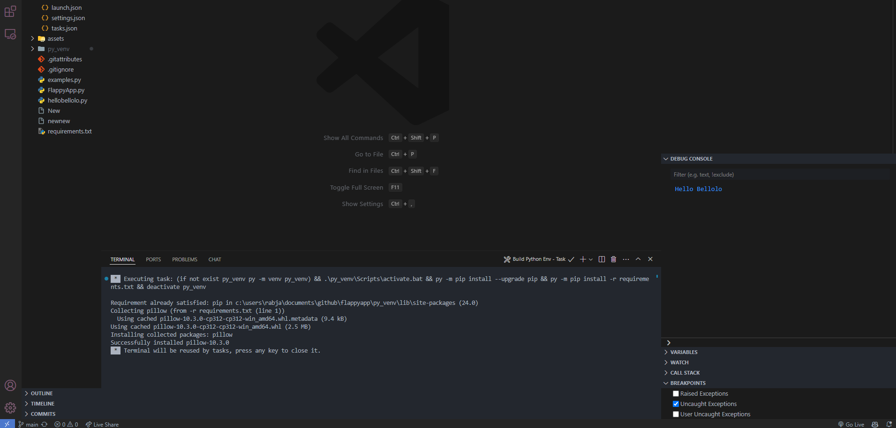

# Basic Github Instructions

`Fetch Origin` means to update the repository on your end. (updating will refresh the files so that you computer know there are changes, but wont actually change any of the files on the computer)

**Note:** _You should always `Fetch Origin` before working on the project to check if there were any changes made by others_

Once you `Fetch Origin`, if there are changes to the repository, `Pull Origin` will be an option.

When you `Pull Origin`, github desktop will change the files on your computer to match the current version of the github project.

# Virtual Enviroment

Now if your project directory already has a `py_venv` folder, your virtual environment should already be working

**Note:** _If you have any other virtual enviroment folders such as venv, .venv, or conda folders, delete them_

You can check this by looking at your terminal and checking if it says `(py_env)` before your project path

### If it doesn't say (py_venv)

Open up you VSCode Command Pallete (Ctrl+Shift+P or Cmd+Shift+P or F1) and type `run task` and select `Tasks: Run Task`

**Note:** _If this doesn't work, you can manually go to command pallete by clicking the settings cog in the bottom left of VSCode, and then click the option for Command Pallete_

Then click `Build Python Env`

And you should get this in the terminal

Now `(py_env)` should show up in the terminal and Python Debugger & Code Runner should work
